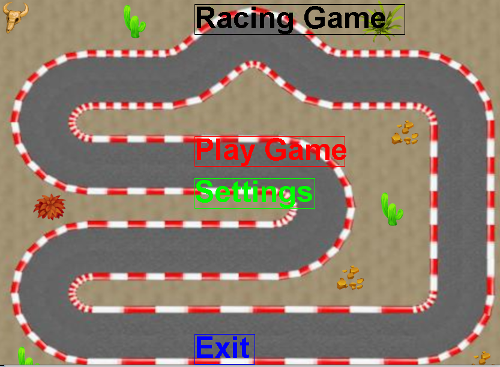
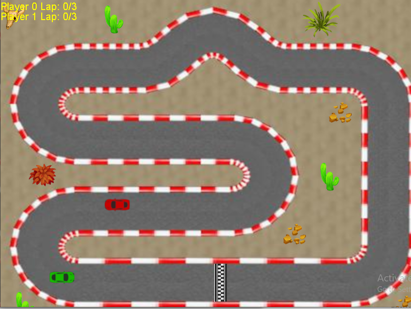

# LBM Racing

A low-budget multiplayer racing game built from scratch in Java.

The project explores game development fundamentals including client-server architecture, networking, game loops, input handling, and real-time multiplayer gameplay.


---

## 🎮 Gameplay






---

## ✨ Features

- Multiplayer racing gameplay
- Client-server networking architecture
- Real-time player communication
- Custom game assets
- Keyboard input handling
- Game state management system

---

## 🏗️ Architecture

The game uses a client-server model:

```
             Client
               |
               |
        Network Connection
               |
               |
             Server
               |
               |
        Game State Management
```

The server manages the shared game state while clients handle player input and rendering.

---

## 🛠️ Technologies

- Java
- Javax Sound
- Javax Swing (Graphics)
- Java AWT (graphics)
- Java Networking

---

## 🚀 Installation

### Requirements

- Java Development Kit (JDK)

Install Java:

### Fedora

```bash
sudo dnf install java-latest-openjdk-devel
```

### Void Linux

```bash
sudo xbps-install -S openjdk
```

---

## 📦 Clone Repository

```bash
git clone https://gitlab.com/zagyarakushi/lbm-racing.git

cd lbm-racing
```

---

## 🔨 Build

Compile the server:

```bash
javac Server.java
```

Compile the client:

```bash
javac Client.java
```

---

## ▶️ Running

Start the server first:

```bash
java Server
```

Then start the client:

```bash
java Client
```

The client requires the server to be running before connecting.

---

## ⚠️ Known Issues

This project is an early game development experiment and contains unfinished features.

Known limitations:

- Some menus are incomplete
- Settings functionality is limited
- Single-player mode is unfinished
- Code organisation and documentation could be improved

---

## 🔮 Future Improvements

Potential improvements:

- Improve physics system
- Refactor game architecture
- Add better multiplayer synchronisation
- Add automated testing
- Improve asset management
- Add build automation

---

## 🤝 Contributing

Contributions are welcome.

1. Fork the repository
2. Create a feature branch
3. Make changes
4. Submit a merge request

---

## 📄 License

MIT License